

  <h1> Quantified_Self_App_v2.0</h1>
  

  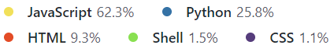
  

An advanced and highly interactive self tracking web app equippped with numerous features. There is complete separation of frontend and backend. The backend is API-based having very tight token-based authentication. It is offers the following features:

- Perform CRUD operations on trackers and logs.
- Graphical visualization of progress over time.
- Export tracker and log data in the form of pdf and csv files.
- Automated emails every month with monthly pdf report attached.
- Daily reminder on google chat using webhooks.
- Token based authentication and secure login/logout.
- Downloadable summary report in pdf and csv formats for trackers, logs or both together.
- Use of caching to enhace performanc.
- Dark Mode, Responsive and elegant UI across all devices.

<h1>Technologies Used</h1>

- HTML/CSS
- JavaScript
- Vuejs
- Chart.js
- Tailwind CSS
- Python
- Flask and its several extensions
- SQLAlchemy
- Celery
- Redis
- Bash
- Sendgrid
- Weasyprint
<h1>Database:</h1><h4> SQLite, Redis</h4>

# Database schema design

  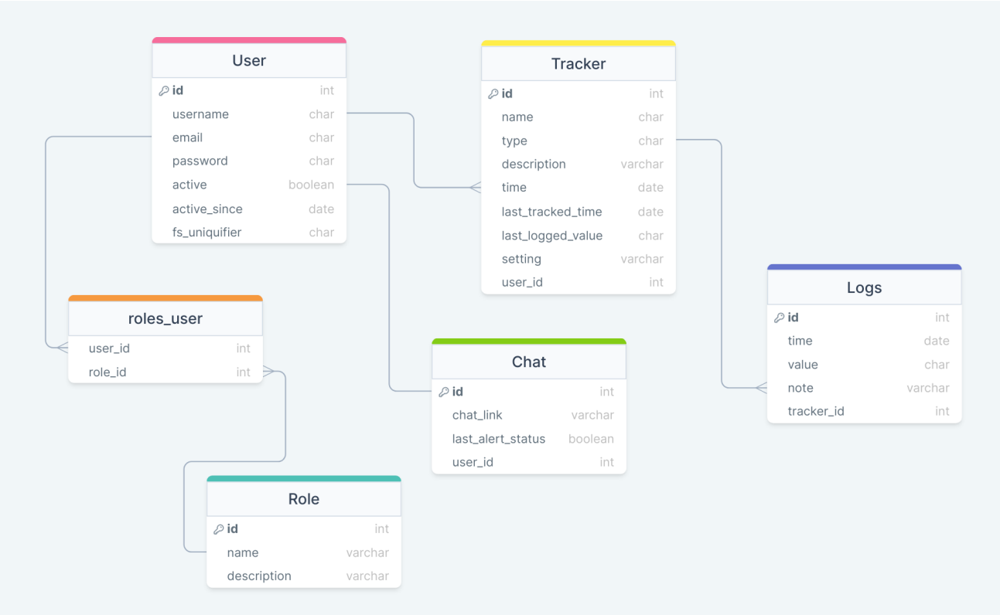

 

# Screenshots
<table border="1">
  <tr>
    <td></td>
    <td></td>
    <td></td>
  </tr>
  <tr>
    <td colspan="3" align="center">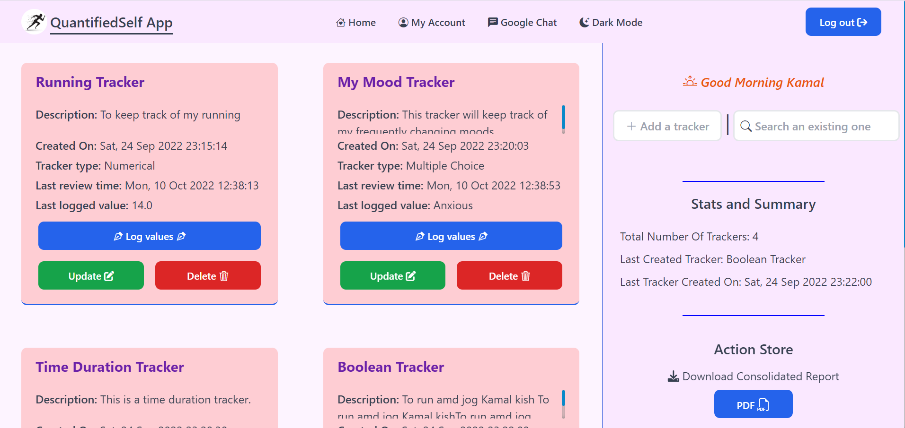</td>
  </tr>
  <tr>
    <td colspan="3" align="center">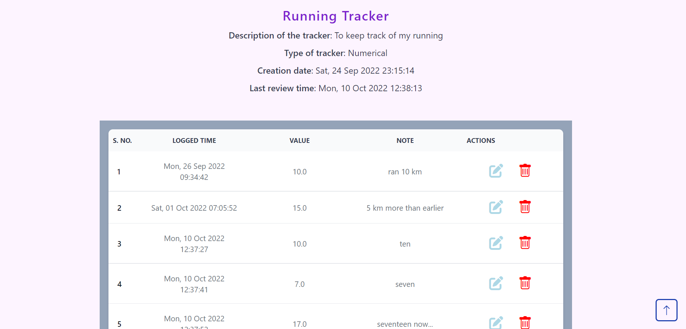</td>
  </tr>
  <tr>
    <td colspan="3" align="center">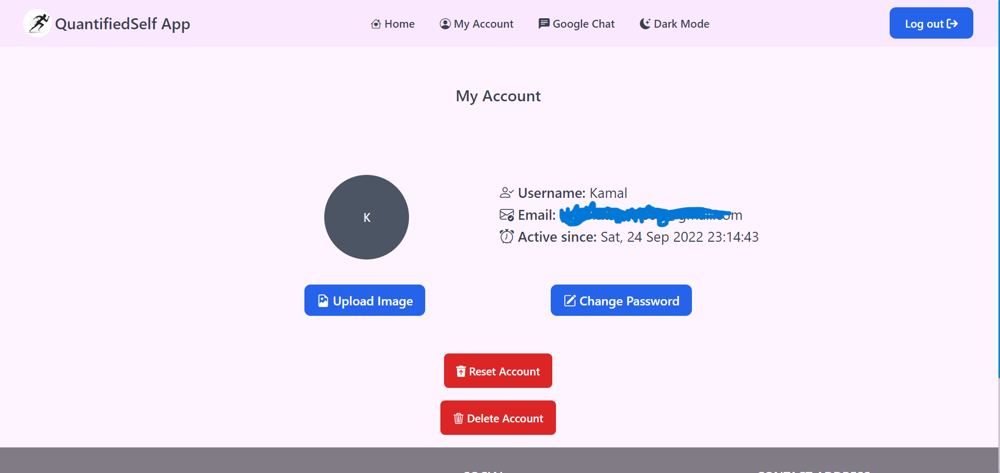</td>
  </tr>
  <tr>
    <td colspan="3" align="center">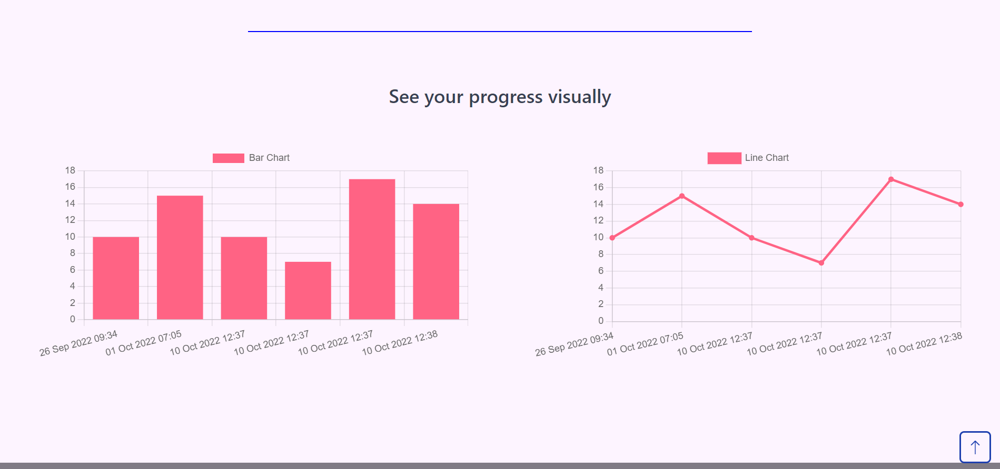</td>
  </tr>
  <tr>
    <td>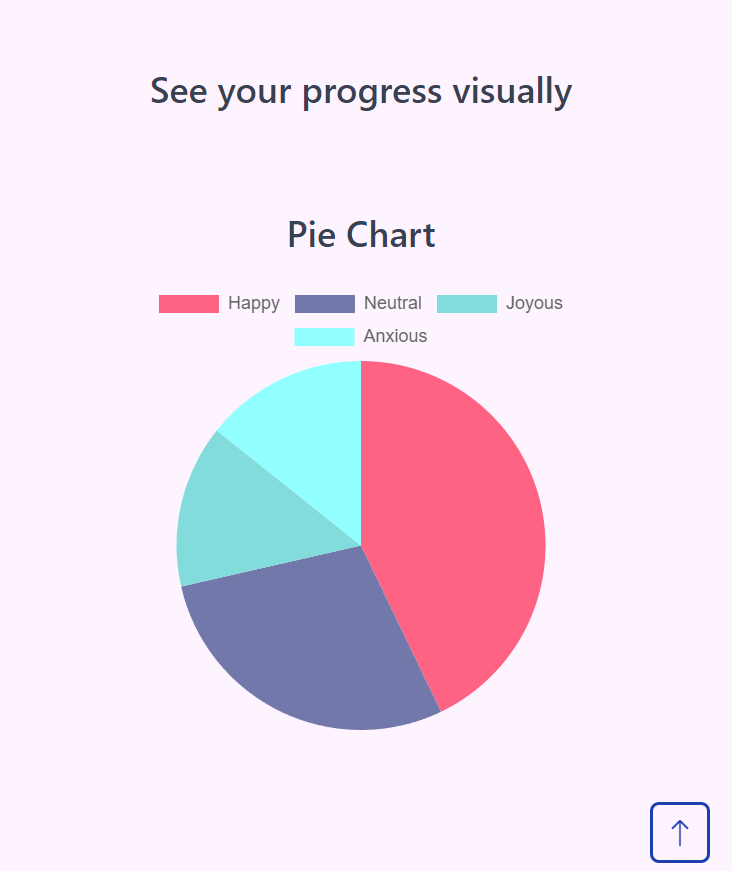</td>
    <td>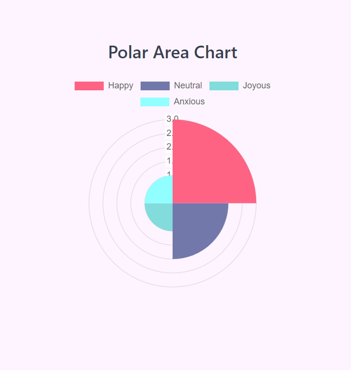</td>
    <td>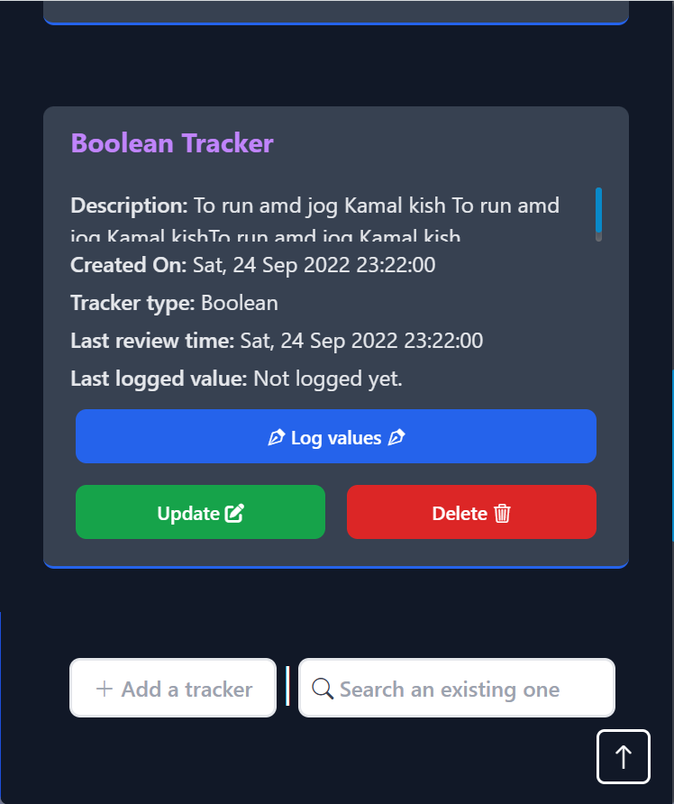</td>
  </tr>
  <tr>
    <td colspan="3" align="center">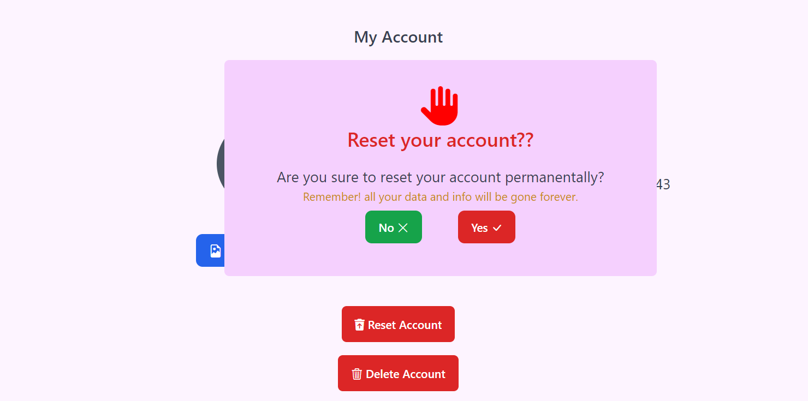</td>
  </tr>
   <tr>
    <td colspan="3" align="center">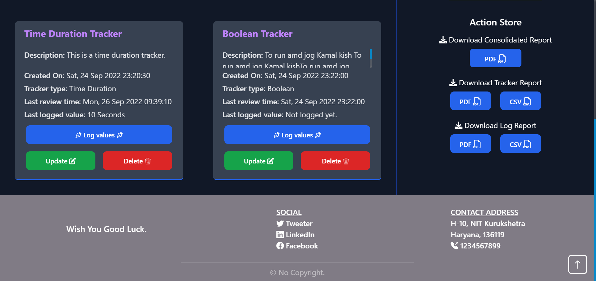</td>
  </tr>
  <tr>
    <td>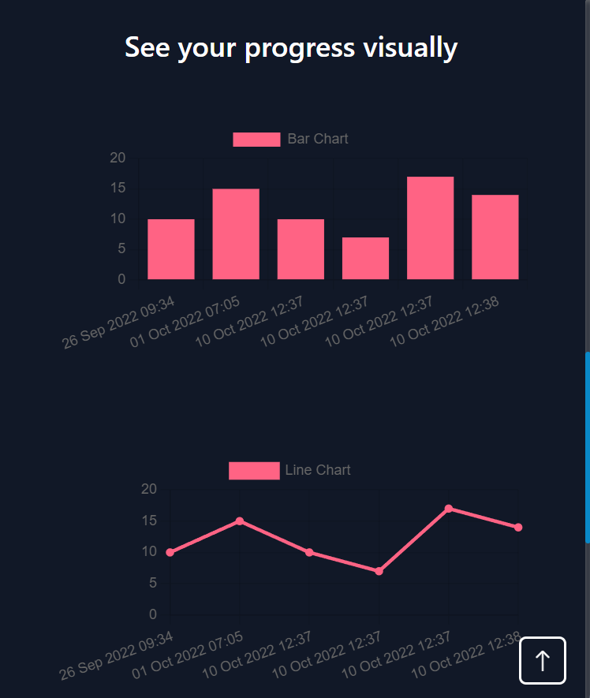</td>
    <td></td>
    <td>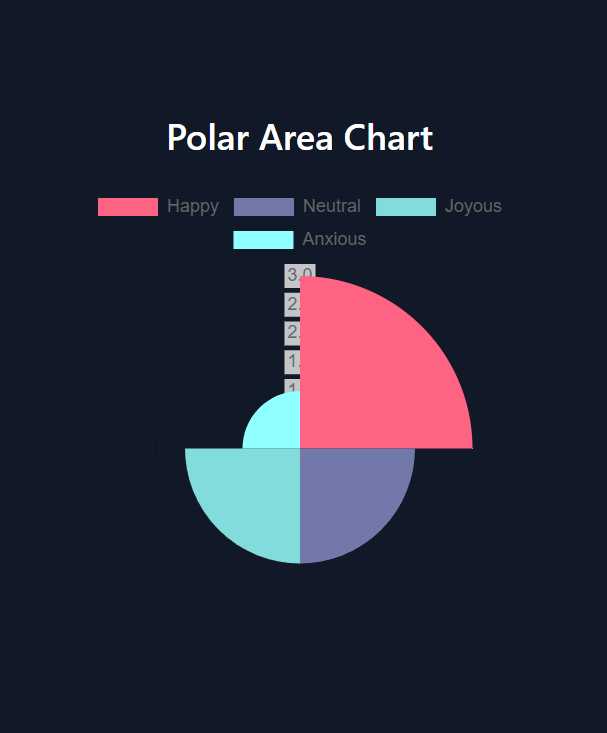</td>
  </tr>
</table>
